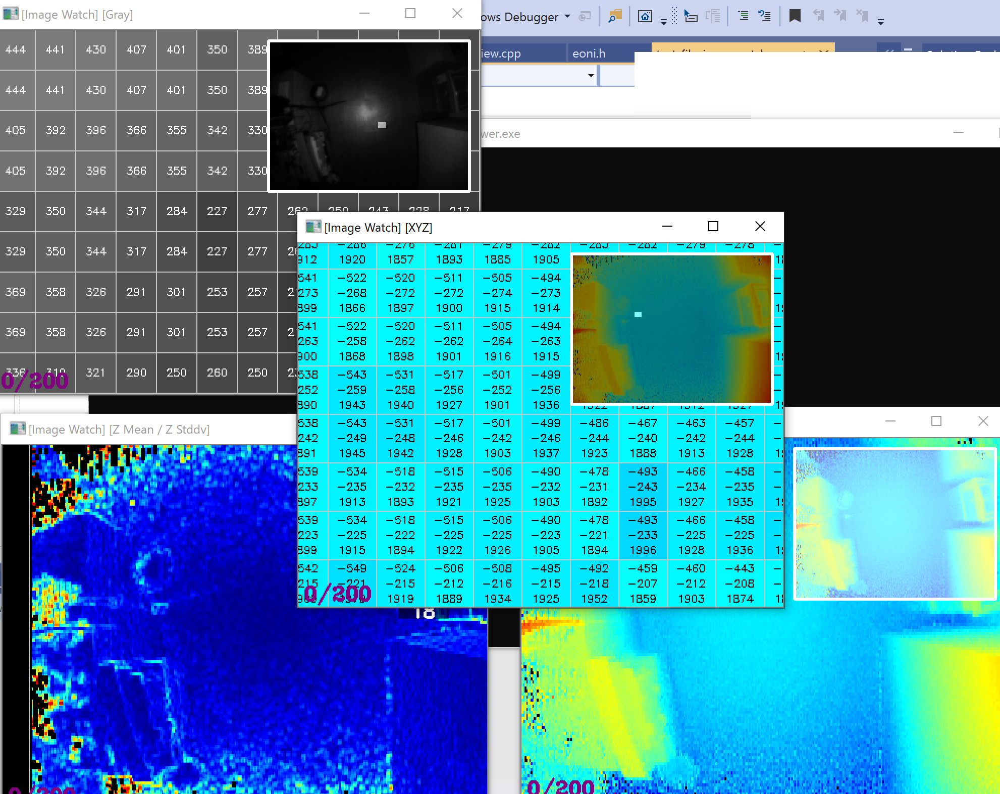
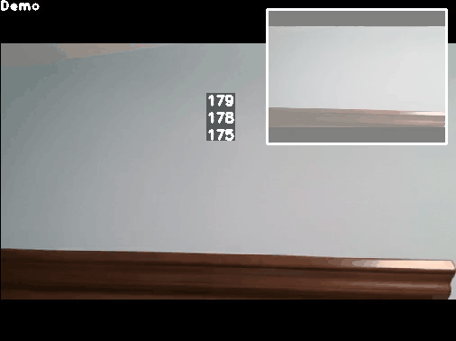

## Project description ##

By using this module, you can view values of a Mat type variable(OpenCV) in real-time, similar to the famous visual studio plugin tool "ImageWatch". This module does not need to enter into any breakpoint at debug mode, and images can be viewed directly in real-time when the program is running.

Currently, this module only supports c++. In the future, this module possibly will support pyhton.

Currently supports:
- mouse drag => translate image
- mouse wheel => scale image
- use mouse to enlarge image => display values in grid mode
- mouse hover => display value (Tiptool)
- use left mouse to double click => set roi of image to center
- use right mouse to click => turn on / turn off global window

The main interface of the program is defined in the following two files
- `src/eunit/emat/emat_viewer.hpp`  	# Window visualization support (Imshow, ...)
- `src/eunit/emat/emat_visual.hpp`  	# Image visualization support (applyColorMap, vhoncat, ...)

#### dependencies  ####
- GCC 5.4
- cmake 2.6 +
- opencv 3.* / 4.*

#### how compile #####
1. this project relies on OpenCV, make sure you have OpenCV compiled.
2. compile
- cmake .
- make

#### emat_viewer.hpp -- introduction of primary functions  ####

1. `void img_show_cache(const string& win_name, const Size& win_size, const Mat& img_colored, const Mat& img_raw, const vector<s_viewer_text>& texts)`

- cache an image: window will be updated/shown after call "imshow"
- @param win_name [in] name of window.
- @param win_size [in] size of window.
- @param img_colored [in] image to display (must be CV_8UC3).
- @param img_raw [in] image with related values corresponding to img_colored (Should be same size with img_colored, but can be different types)
- @param texts [in] texts will be rendered on screen (subtitle)
- @return
   
2. `void visible_wins(vector<string>& win_names)`

- get visible windows
- @param win_names [out] wisible windows
- @return
	
3. `bool is_win_closed(const string& win_names)`

- is window closed
- @param win_names [in] name of window
- @return
  
4. `void imgs_show(bool reopen_win)`

- imshow all images cached
- @param reopen_win [in] whether reopen window, when a window is closed by user. 
- @return
		
5. `void destroy_all()`

- destroy all winodws
- @return

6. `void destroy(const string& win_name)`

- destroy specific window
- @param win_names [in] name of window

addition:

1. If you want to view windows in your own UI, just override these functions (Easy to combine with Qt, ...)

- destroy_window
- named_window
- resize_window
- img_show
- get_window_image_rect
- set_mouse_callback
- get_mouse_wheel_delta

	
#### emat_visual.hpp -- introduction of primary functions  ####

1. `void vis_gconcat(const vector<Mat>& imgs, const uint32_t& cols, Mat& res)`

- apply grid concat 
- @param imgs [in] array with Mat type (must be same cv_type, but can be different size)
- @param cols [in] the max count of images can be put in each colume
- @param res [out] variable with Mat type (CV_8UC3)
- @return

2. `void vis_vconcat(const vector<Mat>& imgs, Mat& res)`

- apply vertical concat
- @param imgs [in] array with Mat type (must be same cv_type, but can be different size)
- @param res [out] variable with Mat type (CV_8UC3)
- @return

3. `void vis_hconcat(const vector<Mat>& imgs, Mat& res)`

- apply horizontal concat
- @param imgs [in] array with Mat type (must be same cv_type, but can be different size)
- @param res [out] variable with Mat type (CV_8UC3)
- @return

4. `void vis_colormap_jet(const Mat& img, Mat& res)`

- apply COLORMAP_JET
- @param img [in] variable with Mat type (must be same cv_type, but can be different size)
- @param res [out] variable with Mat type (CV_8UC3)
- @return

5. `void vis_gray(const Mat& img, Mat& res)`

- apply normalization
- @param img [in] variable with Mat type (must be same cv_type, but can be different size)
- @param res [out] variable with Mat type (CV_8UC3)
- @return
